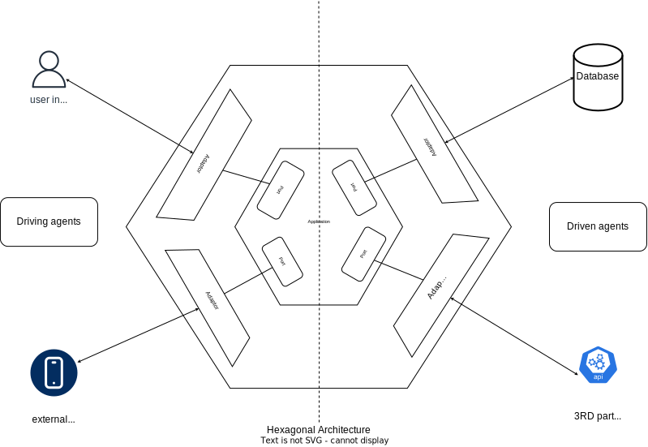

# Hexagonal Architecture for go
A hexagonal Architecture implementation for Go Lang web applications 

## Understanding Hexagonal Architecture and Its Benefits in GoLang

In the realm of software development, creating robust and maintainable applications is a perpetual pursuit. One architectural paradigm that has gained traction for its ability to enhance code maintainability and flexibility is Hexagonal Architecture, often referred to as Ports and Adapters.

### Overview

**What is Hexagonal Architecture?**

Hexagonal Architecture emphasizes a clear separation of concerns, creating software systems with well-defined boundaries. The core business logic remains decoupled from external dependencies.


### Hexagonal Architecture Schema




#### Core Principles

- **Ports:** Represent interfaces or contracts defining the application's interaction with the external world.
- **Adapters:** Implement interfaces defined in ports, connecting the application to external resources.

### Implementation in GoLang

GoLang's simplicity and flexibility align well with Hexagonal Architecture. The language's interface support enables building systems with clear boundaries.

#### Structure

- **Core Domain Logic:** Houses business logic, entities, and use cases.
- **Ports:** Interfaces defining core logic's interaction with external components.
- **Adapters:** Implementations of port interfaces linking core logic to databases, APIs, or other services.
- **Dependency Injection:** GoLang's interface support facilitates dependency injection for testing and component replacement.

### Benefits in GoLang

#### Testability and Maintainability

- **Isolation of Concerns:** Separation allows easier unit testing and maintenance.
- **Replaceable Adapters:** Easy switching of adapters without impacting core logic.

#### Flexibility and Scalability

- **Loose Coupling:** Allows swapping or upgrading components without system-wide impact.
- **Easier Extension:** Adding features becomes manageable within defined boundaries.

#### Clean Code and Readability

- **Clear Structure:** Encourages organized codebases, aiding readability.
- **Focused Logic:** Separating concerns helps focus on core business logic.

### Conclusion

Hexagonal Architecture offers a structured approach to building software systems, promoting maintainability, testability, and flexibility. Leveraging this architecture in GoLang facilitates modular, adaptable, and maintainable codebases, aligning with the language's principles.

# Project Structure Overview

## Directory Structure

- `/libs`: Contains the libarries implementaion for many common components being used in the project.

- `/cmd`: Contains the main entry point for your application. Each service or component could have its own subdirectory here.

- `/internal`: Holds the internal packages of the application.
  - `/driving` : Driving actors of the architecture like user, external app etc
    - `/adapters`: Contains adapters for external systems or frameworks.
        - `/http`: Adapter handling incoming HTTP requests.
    - `/usecases`: Contains implementations of use cases that orchestrate the business logic.
  - `/driven` : Driven actors of the architecture like user, external app etc
    - `/adapters`: Contains adapters for external systems or frameworks.
        - `/database`: Adapter interacting with the database.
        - `/http`: Adapter handling incoming HTTP requests.
    - `/usecases`: Contains implementations of use cases that orchestrate the business logic.
  - `/domain`: Contains the core business logic and domain model.
    - `/model`: Contains domain models or entities.
    - `your_domain.go`: Defines interfaces (ports) that interact with the domain.
  
- `/test`: Houses all test-related files.


## Overview

This project implements a web-based API for a task management system using GoLang. It focuses on providing RESTful endpoints for creating, updating, and organizing tasks. The aim is to create a scalable and efficient task management solution for small to medium-sized teams.

## Features

- RESTful API for task CRUD operations
- User authentication and authorization
- Task prioritization and categorization
- Database persistence for task storage
- Scalable architecture for handling increased loads

## Table of Contents

- [Getting Started](#getting-started)
- [Testing](#testing)
- [Contributing](#contributing)
- [Acknowledgments](#acknowledgments)
- [License](#license)

## Getting Started

To get started with this project:

1. Clone this repository:

    ```bash
    git clone https://github.com/mohammad-siraj/hexarchgo.git
    ```

2. Navigate to the project directory:

    ```bash
    cd hexarchgo
    ```

3. Set up the database:

    - Create a PostgreSQL database named `tasks_db`.
    - Update the database connection details in `config/config.go`.

4. Run the application:

    ```bash
    go run main.go
    ```

## Pending Functionality 

- Grpc gateway implemenation
- Swagger UI implemenation
- No Sql Database integartion with utils
- Dockerfile for containerization

- Codecov integration
- JWT Authentication
- Rate Limiting
- Monitoring and Logging tools (Prometheus, Grafana, Zipkin etc.)
- Kubernetes Deployment
- Helm Chart for K8S deployment
- Cloud Provider Integrations (AWS, GCP)
- Distributed Tracing Tools (Zipkin, Jaeger)
- Retry Mechanism Implementation

- CI/CD pipeline setup (Github Actions, Gitlab CI or Jenkins?)